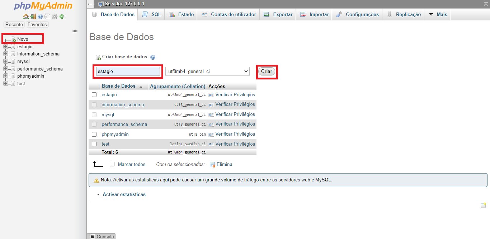

# LISA, um sistema de controle de estágio.

Este foi o Trabalho de Conclusão de Curso do curso Técnico em Informática, promovido pela Universidade Adventista de São Paulo, Campus Hortolândia, desenvolvido por João Sena e Manuela Velez em 2019.

Nosso projeto constitui-se em um sistema de controle de estágio, que será supervisionado por um ou mais administradores que terão acesso a todas as funções do sistema. É possível iniciar e finalizar estágios, ter um controle dos alunos, registro de suas atividades e gerar relatórios sobre seus horários.

As seções abaixo contemplam todo material produzido ao longo do projeto. 

## Apresentação

O projeto foi apresentado dia 25 de outubro de 2020, e pode ser visto baixando o seguinte arquivo:

[Apresentação vídeo](docs/TCC_João_Sena_e_Manuela_Velez_-_TI.mp4)

Os slides presentes no vídeo podem ser acessados abaixo:

[Apresentação PDF](docs/Apresentação.pdf)

## Integrantes 

#### João Sena

[Github](https://github.com/joaosena19)
[Linkedin](https://www.linkedin.com/in/joaosena19/)
[Currículo](docs/joao_sena_cv.pdf)

#### Manuela Velez

[Github](https://github.com/ManuelaVelez26)
[Linkedin](https://www.linkedin.com/in/manuela-velez-00157a197/)
[Currículo](docs/manuela_velez_cv.pdf)

(Currículos desatualizados, criados especialmente para este projeto, no ano de 2019. Apresentados assim para preservar a integridade do projeto).

## Sigma Soft

Foi criada uma empresa fictícia para ser responsável pela elaboração do sistema, chamada Sigma Soft. Uma breve introdução pode ser vista na nossa apresentação institucional.

[Apresentação Sigma Soft](docs/Sigmasoft.pdf)

O site da Sigma Soft pode ser acessado neste link:

[Sigma Soft](https://joaosena19.github.io/tcc-ti-2019/)

## Cronograma

Foi criado um cronograma para auxiliar o planajemanto e organização.

[Planilha Cronograma](docs/Cronograma.xlsx)

## Documentação

As funções e estruturas do sistema estão documentadas no arquivo abaixo:

[Documentação PDF](docs/Documentação_TCC.pdf)

## Código Fonte

O código fonte pode ser [acessado aqui](src).

## Instalação

O sistema foi desenvolvido com backend PHP, e para ser testado localmente, precisamos simular um servidor. Será utilizado o XAMPP como exemplo, mas existem outros programas que fazem a mesma função.

1. Instale o [programa XAMPP, a versão utilizada foi a 7.1.32](https://sourceforge.net/projects/xampp/files/XAMPP%20Windows/7.1.32/). Lembre-se do local de instação, por padrão `C:\xampp`.
2. Vá no [código fonte](src/), entre na pasta `Sistema (Dashboard)` e baixe a pasta `estagio`.
3. Coloque esta pasta em `htdocs`, dentro da pasta onde o XAMPP foi instalado, por padrão `C:\xampp\htdocs`.
4. Inicie o programa XAMPP Control e clique em `start` para os dois primeiros módulos.

5. No módulo `MySQL` clique em Admin para ser direcionado à página de configuração do banco de dados, ou então, digite diretamente no seu navegador: `http://localhost/phpmyadmin/server_databases.php?`.
6. Nessa nova página, vá em `Novo` e crie uma base dados chamada `estagio` (é importante ter esse nome específico!).

7. Vá em `Importar` e selecione o arquivo [`estagio.sql`](src/estagio.sql), que está na pasta [`src/estagio.sql`](src/estagio.sql).

8. Pronto! Agora é só acessar o sistema usando qualquer navegador através do link http://localhost/estagio/. O usuário e senha padrão são ambos `admin`.
